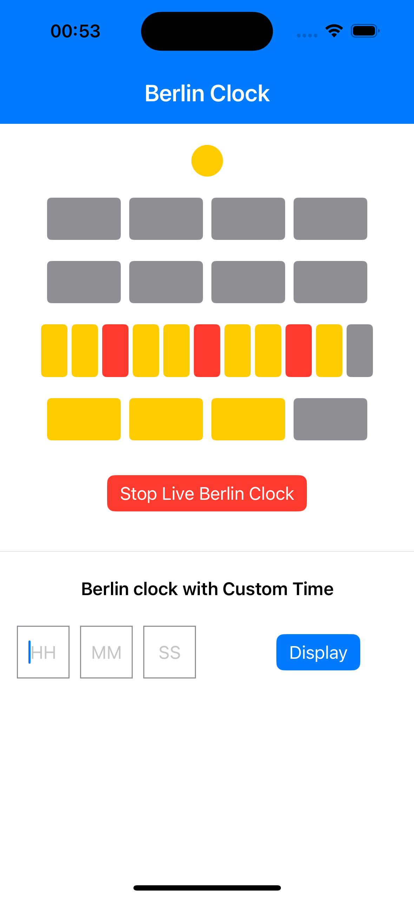
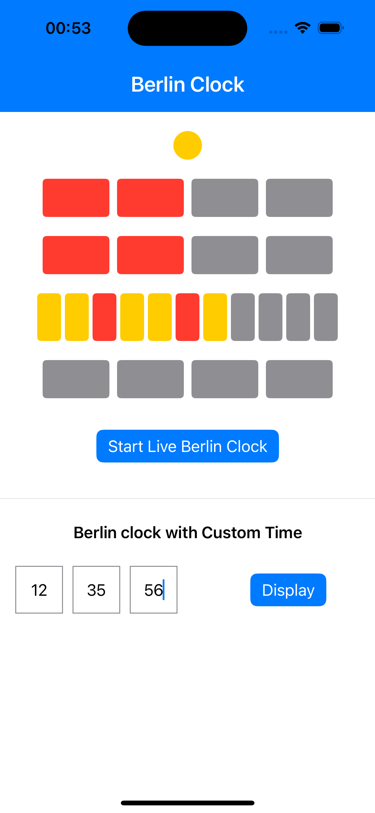

# Berlin Clock

A SwiftUI implementation of the famous Berlin Clock (Mengenlehreuhr) - the world's first public clock that tells time using illuminated colored lamps.

## About

The Berlin Clock displays time through a unique system of colored lamps:

- **Top Circle**: Blinks yellow every even second
- **First Row**: 4 red lamps, each representing 5 hours
- **Second Row**: 4 red lamps, each representing 1 hour
- **Third Row**: 11 lamps (yellow and red), each representing 5 minutes
- **Fourth Row**: 4 yellow lamps, each representing 1 minute

## Requirements

- Xcode 16.0 or later
- iOS 17.0 or later

## How to Run

1. Clone the repository
2. Open `BerlinClock_042.xcodeproj` in Xcode
3. Select a simulator or connected device
4. Press `Cmd + R` to build and run

### Running Tests

Press `Cmd + U` to run all unit tests.

## App Features

### Live Clock
The app launches with a live Berlin Clock that updates every second using the device's system time. Users can pause and resume the clock using the Start/Stop button.

### Custom Time Tester
Below the clock, users can enter any time manually to see how it appears on the Berlin Clock. This is useful for testing and understanding how the clock works. The app validates input and shows error messages for invalid values.

## Design Patterns & Coding Standards

### Test-Driven Development (TDD)
Every feature was built following the Red-Green-Refactor cycle. Tests were written first, then the minimum code to pass, followed by refactoring for cleaner code. This ensures reliability and makes future changes safer.

### MVVM Architecture
The app separates concerns clearly. Views handle only the UI display. ViewModels manage the state and business logic. This makes the code easier to test and maintain.

### Protocol-Oriented Design
Time fetching uses a protocol, allowing the real system clock in the app and a mock clock in tests. This makes testing predictable and reliable without waiting for real time to pass.

### Clean Architecture
The project is organized into clear layers:
- **Presentation**: Views and ViewModels
- **Domain**: Clock converters that transform time into lamp states  
- **Data**: Time providers and entities

### Single Source of Truth
Each piece of data has one owner. The ViewModel owns the clock state, while the View owns temporary input fields. This prevents bugs from conflicting data.

### Dependency Injection
Components receive their dependencies rather than creating them. This makes code flexible and testable.

### Constants Over Magic Numbers
All
